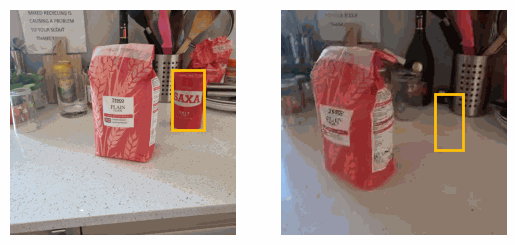

# [The Change You Want to See (Now in 3D)](#)

[[Project Page]](#) [[arXiv]](https://arxiv.org/abs/2308.10417)

In Proceedings of the IEEE/CVF International Conference on Computer Vision (ICCV) 2023

[Ragav Sachdeva](https://ragavsachdeva.github.io/), [Andrew Zisserman](https://scholar.google.com/citations?hl=en&user=UZ5wscMAAAAJ)



## Installation

**Clone the repository**

```
git clone --recursive git@github.com:florianpfleiderer/CYWS-3D.git
```

**Install depedencies**

```
docker build -t cyws3d:latest .
```


## Datasets

TODO


## Pre-trained model

```
wget https://thor.robots.ox.ac.uk/cyws-3d/cyws-3d.ckpt.gz
gzip -d cyws-3d.ckpt.gz
```

## Example Usage

Please try running:

`python inference.py --load_weights_from ./cyws-3d.ckpt`

This should perform a batched inference on a set of example image pairs under various settings (see [this file](demo_data/input_metadata.yml)).
If you want to use your own images, please use my_data folder and change lines 11 and 12 in inference.py.

## Citation

```
@InProceedings{Sachdeva_ICCVW_2023,
    title = {The Change You Want to See (Now in 3D)},
    author = {Sachdeva, Ragav and Zisserman, Andrew},
    booktitle = {Proceedings of the IEEE/CVF International Conference on Computer Vision (ICCV)},
    year = {2023},
}
```
